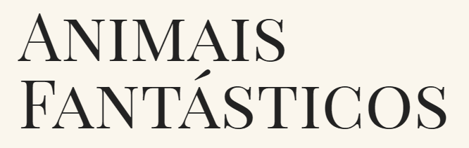

<h1 align="center" >
    
</h1>

<h1 align="center">
    
</h1>

# Sobre 🚀
Projeto desenvolvido no curso de  Javascript Completo ES6 da 
[**Origamid**](https://www.origamid.com). 

## Habilidades
- Como criar navegação por Tabs
- Accordion List
- Scroll suave em links internos
- Animação ao scroll
- Responsividade

---

# Tecnologias utilizadas
- HTML
- CSS
- Javascript

Desenvolvido por Anderson Apparecido
